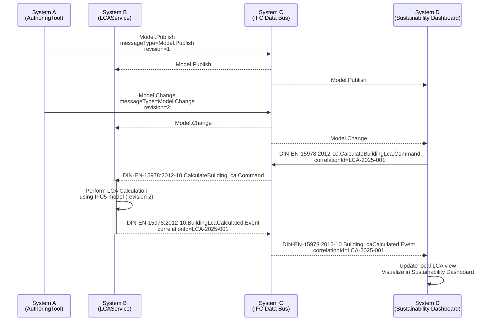

# IFC data bus v0.2

## The Challenge

**IFC data bus 0.2** is a challenge of the **AEC/O Hackathon 2025 – Munich Edition**.

<a href="ifc-data-bus challenge Munich.pdf">The Challenge Presentation (.pdf)</a>

## Problem Statement

Architects and planners rely on a broad ecosystem of software tools, yet **poor data integration between these tools creates major bottlenecks** in the design process. This fragmentation prevents holistic project optimization and slows down coordination. Although OpenBIM aims to support interoperability, it still lacks robust mechanisms for **bi-directional data exchange**—particularly when it comes to **re-integrating data into CAD and CDE environments**. Existing initiatives often do not prioritize full OpenBIM compliance, leaving a clear opportunity for alternative, standards-aligned solutions.

At the same time, the emerging **modularized and layerized IFC5** standard introduces new capabilities for more flexible, fine-grained, and machine-friendly data handling. These advances open the door to new workflows built around decentralized, event-driven data exchange rather than monolithic file transfers.

## Goal

- Solve the hard problem of conflict resolution by leveraging IFC5
- Learn about IFC5 and event-driven systems
- Publish an awesome Demo! :)

In detail:

Develop a proof-of-concept for an **IFC Data Bus** that performs a simplified **LCA calculation** and demonstrates decentralized data synchronization using **IFC5**, **MQTT**, and **IDS**, leveraging the **modularity and layered structure of IFC5** to enable more scalable and targeted data flows.  

The system should consist of **three interoperating components** that **publish, process, and read model data** across the data bus.

The entire solution should be delivered as an easy-to-run **docker-compose** setup and published on GitHub for straightforward adoption.

Last but not least, IFC data bus needs a logo :)

## Resources

1. <a href="https://drive.google.com/file/d/1G6e2UCSyiQRj5Dxday6ytkK4VL-FCIHI/view?usp=sharing">Test IFC File</a> (requires IFC5 conversion)
2. [MQTT docker container](2025-11%20AECO%20Hackathon%20Munich/mqtt/)
3. Message Flow

4. [Message Format](2025-11%20AECO%20Hackathon%20Munich/message_format/) (our starting point, requires thoughtful adoption to IFC5)
5. IDS files